# nbxflow: Notebook Ops for Dataflow, Taskflow, and PerfFlow

[](https://opensource.org/licenses/Apache-2.0)
[](https://www.python.org/downloads/)
[]()

> Transform exploratory notebooks into production-ready data pipelines with comprehensive observability.

**nbxflow** bridges the gap between notebook-based data exploration and production data pipelines by providing unified instrumentation for data lineage (OpenLineage), performance monitoring (OpenTelemetry), and data quality contracts (Great Expectations). It captures the intent and execution of notebook operations, making them observable, governable, and exportable to orchestration platforms.

## Table of Contents

- [Project Aim & Vision](#project-aim--vision)
- [Key Objectives](#key-objectives)
- [Why nbxflow?](#why-nbxflow)
- [Core Architecture](#core-architecture)
- [Project Structure](#project-structure)
- [Installation](#installation)
- [Quick Start](#quick-start)
- [Comprehensive Usage Guide](#comprehensive-usage-guide)
- [CLI Reference](#cli-reference)
- [Configuration](#configuration)
- [Integration Examples](#integration-examples)
- [Export & Orchestration](#export--orchestration)
- [Development Roadmap](#development-roadmap)
- [Contributing](#contributing)
- [Project Status](#project-status)
- [License](#license)

## Project Aim & Vision

### The Problem

Data teams face a fundamental challenge: **the notebook-to-production gap**. Data scientists and analysts build valuable pipelines in Jupyter notebooks, but moving them to production requires:

1. **Rewriting logic** for orchestration platforms (Airflow, Prefect, Dagster)
2. **Adding observability** after the fact (lineage, monitoring, quality checks)
3. **Managing complexity** across multiple tools and formats
4. **Losing context** between exploratory and production environments

### The Vision

**nbxflow** envisions a world where:
- **Notebooks are first-class citizens** in the data lifecycle
- **Observability is built-in**, not bolted-on
- **Production deployment** is export, not rewrite
- **Open standards** prevent vendor lock-in
- **AI assistance** handles complexity automatically

## Key Objectives

### 1. **Unified Observability** 
Integrate data lineage (OpenLineage), performance monitoring (OpenTelemetry), and data quality (Great Expectations) through a single, coherent API.

### 2. **Notebook-Native Design**
Minimal instrumentation that works naturally in notebook environments without disrupting exploratory workflows.

### 3. **Production Pathway**
Clear, automated path from instrumented notebooks to production orchestration (Airflow, Prefect, Dagster) with preserved observability.

### 4. **Open Standards First**
Built on OpenLineage, OpenTelemetry, and open data quality standards to avoid vendor lock-in and ensure interoperability.

### 5. **LLM-Enhanced Operations**
Intelligent assistance for component classification, schema generalization, and pipeline optimization.

## Why nbxflow?

### Existing Solutions Gaps

| Solution Type | Examples | Strengths | Limitations |
|---------------|----------|-----------|-------------|
| **Engine-Specific** | Spark Spline, Unity Catalog | Deep integration | Limited to specific engines |
| **Platform-Centric** | DataHub, OpenMetadata | Broad coverage | Heavy deployment, not notebook-native |
| **Orchestrator-Bound** | Airflow, Dagster lineage | Production-ready | Misses exploration phase |
| **Notebook Frameworks** | Ploomber, Papermill | Notebook-friendly | Limited observability |

### nbxflow's Unique Position

**nbxflow** occupies the unique intersection of:
- ✅ **Notebook-native** instrumentation
- ✅ **Open standards** based (no lock-in)
- ✅ **Multi-platform** export capability
- ✅ **Comprehensive observability** (lineage + perf + quality)
- ✅ **LLM-enhanced** operations

## Core Architecture

### Three-Pillar Foundation


### Component Types Taxonomy

nbxflow classifies pipeline components into 10 standardized types:

| Type | Purpose | Examples | Parallelizable |
|------|---------|----------|----------------|
| **DataLoader** | Ingests data from sources | CSV readers, API fetchers, DB queries | ❌ |
| **Transformer** | Modifies existing data | Cleaning, normalization, feature engineering | ✅ |
| **Reconciliator** | Matches/deduplicates entities | Fuzzy matching, entity resolution | ✅ |
| **Enricher** | Adds external information | API lookups, geocoding, ML scoring | ✅ |
| **Exporter** | Outputs data to destinations | File writers, API pushers, DB inserts | ❌ |
| **QualityCheck** | Validates data quality | Schema validation, business rules | ✅ |
| **Splitter** | Divides datasets | Train/test splits, partitioning | ✅ |
| **Merger** | Combines datasets | Joins, unions, aggregations | ❌ |
| **Orchestrator** | Coordinates other components | Workflow management, scheduling | ❌ |
| **Other** | Uncategorized components | Custom business logic | ❓ |

### Data Flow Model

```python
# Conceptual data flow
with nbxflow.flow("pipeline_name"):
    with nbxflow.step("step_name", component_type="Enricher") as step:
        # 1. Mark inputs for lineage
        nbxflow.mark_input(dataset)
        
        # 2. Attach performance metrics
        with Metrics("step_name") as m:
            nbxflow.attach_metrics(m)
            # ... your processing logic ...
        
        # 3. Mark outputs for lineage
        nbxflow.mark_output(dataset)
        
        # 4. Add data contracts
        step.add_contract(contract)
```

## Project Structure

```
nbxflow/
├── 📁 nbxflow/                    # Main package
│   ├── 📄 __init__.py             # Public API exports
│   ├── 📄 version.py              # Version management
│   ├── 📄 config.py               # Configuration management
│   │
│   ├── 📁 core/                   # Core functionality
│   │   ├── 📄 step.py             # Flow & Step context managers
│   │   ├── 📄 datasets.py         # Dataset reference system
│   │   ├── 📄 facets.py           # OpenLineage custom facets
│   │   ├── 📄 lineage.py          # OpenLineage integration
│   │   ├── 📄 otel.py             # OpenTelemetry integration
│   │   ├── 📄 metrics_adapter.py  # Metrics integration
│   │   └── 📄 registry.py         # FlowSpec registry
│   │
│   ├── 📁 contracts/              # Data quality contracts
│   │   ├── 📄 ge.py               # Great Expectations integration
│   │   ├── 📄 registry.py         # Contract versioning
│   │   └── 📄 utils.py            # Contract utilities
│   │
│   ├── 📁 llm/                    # LLM-powered features
│   │   ├── 📄 client.py           # LLM client abstraction
│   │   ├── 📄 prompts.py          # Prompt templates
│   │   ├── 📄 classifier.py       # Component classification
│   │   └── 📄 refine_contracts.py # Contract refinement
│   │
│   ├── 📁 exporters/              # Export to orchestrators
│   │   ├── 📄 airflow_exporter.py # Airflow DAG generation
│   │   ├── 📄 prefect_exporter.py # Prefect flow generation
│   │   ├── 📄 dagster_exporter.py # Dagster assets generation
│   │   └── 📄 graphviz.py         # Visualization export
│   │
│   ├── 📁 cli/                    # Command-line interface
│   │   ├── 📄 __main__.py         # CLI entry point
│   │   └── 📁 commands/           # CLI commands
│   │       ├── 📄 export.py       # Export command
│   │       ├── 📄 lineage.py      # Lineage analysis
│   │       ├── 📄 contracts.py    # Contract management
│   │       └── 📄 classify.py     # Component classification
│   │
│   └── 📁 utils/                  # Utility functions
│       ├── 📄 ids.py              # ID generation
│       ├── 📄 time.py             # Time utilities
│       ├── 📄 logging.py          # Logging setup
│       └── 📄 io.py               # I/O operations
│
├── 📁 examples/                   # Usage examples
│   ├── 📄 simple_flow.py          # Basic usage example
│   ├── 📄 advanced_pipeline.py    # Advanced features demo
│   └── 📄 notebook_snippets.py    # Jupyter notebook patterns
│
├── 📁 tests/                      # Test suite
│   ├── 📄 test_registry.py        # Registry tests
│   ├── 📄 test_facets.py          # Facets tests
│   ├── 📄 test_lineage_emit.py    # Lineage emission tests
│   ├── 📄 test_exporters.py       # Export functionality tests
│   └── 📄 test_ge_infer.py        # Great Expectations tests
│
├── 📄 pyproject.toml              # Package configuration
├── 📄 requirements-dev.txt        # Development dependencies
├── 📄 .env.example                # Environment configuration template
├── 📄 test_runner.py              # Development test runner
├── 📄 README.md                   # This file
├── 📄 LICENSE                     # Apache 2.0 license
└── 📄 CONTRIBUTING.md             # Contribution guidelines
```

## Installation

### Option 1: Development Mode (Recommended)

For testing and development:

```bash
# Clone the repository
git clone https://github.com/your-org/nbxflow.git
cd nbxflow

# Install core dependencies
pip install pydantic typing-extensions pandas numpy python-dotenv

# Run tests
python test_runner.py
```

### Option 2: Package Installation

For production use:

```bash
# Install with all features
pip install -e ".[all]"

# Or install specific feature sets
pip install -e ".[core,ol,otel]"      # Core + observability
pip install -e ".[core,ge,llm]"       # Core + quality + AI
```

### Dependency Breakdown

| Feature Set | Dependencies | Purpose |
|-------------|-------------|---------|
| **core** | `pydantic`, `typing-extensions` | Basic functionality |
| **ol** | `openlineage-client` | Data lineage tracking |
| **otel** | `opentelemetry-sdk`, `opentelemetry-exporter-otlp` | Performance monitoring |
| **prometheus** | `prometheus-client` | Metrics export |
| **ge** | `great-expectations`, `pyyaml` | Data quality contracts |
| **llm** | `openai`, `tiktoken` | AI-powered features |
| **exporters** | `jinja2` | Code generation |
| **all** | All of the above | Complete functionality |

## Quick Start

### 1. Environment Setup

Copy the environment template:

```bash
cp .env.example .env
```

Edit `.env` with your configuration:

```bash
# Minimal setup for local testing
OTEL_SERVICE_NAME=my_pipeline
OTEL_ENABLE_CONSOLE=true
NBX_WARN_ON_MISSING_IO=true

# Optional: Add LLM support
NBX_LLM_PROVIDER=openai
NBX_LLM_API_KEY=sk-your-key-here
```

### 2. Basic Usage

```python
import nbxflow
import pandas as pd

# Simple pipeline with observability
with nbxflow.flow("my_first_pipeline"):
    
    # Step 1: Load data
    with nbxflow.step("load_data", component_type="DataLoader"):
        df = pd.read_csv("data.csv")
        
        nbxflow.mark_input(nbxflow.dataset_file("data.csv"))
        nbxflow.mark_output(nbxflow.dataset_file("processed.parquet"))
        
        print(f"Loaded {len(df)} records")
    
    # Step 2: Transform data  
    with nbxflow.step("clean_data", component_type="Transformer"):
        nbxflow.mark_input(nbxflow.dataset_file("processed.parquet"))
        
        cleaned_df = df.dropna()
        
        nbxflow.mark_output(nbxflow.dataset_file("cleaned.parquet"))
        
        print(f"Cleaned: {len(df)} -> {len(cleaned_df)} records")

# Automatic export to JSON
# Generates: my_first_pipeline_flow_<uuid>.json
```

### 3. With Metrics Integration

```python
# Your existing metrics class
class Metrics:
    all_metrics = []
    
    def __init__(self, operation: str, **kwargs):
        self.operation = operation
        self.data = {'operation': operation, **kwargs}
        self.start_time = time.time()
    
    def __enter__(self):
        return self
    
    def __exit__(self, exc_type, exc_val, exc_tb):
        self.data['wall_time_seconds'] = time.time() - self.start_time
        Metrics.all_metrics.append(self.data)

# Use with nbxflow
with nbxflow.flow("metrics_integrated_pipeline"):
    with nbxflow.step("process_data", component_type="Enricher"):
        with Metrics("process_data", n_records=1000) as m:
            nbxflow.attach_metrics(m)  # Links metrics to step
            
            # Your processing logic here
            time.sleep(1)  # Simulate work
            
            # Metrics automatically captured in OpenLineage events
```

### 4. Export to Production

```bash
# Export to Airflow
nbxflow export --flow-json my_first_pipeline_flow_*.json --to airflow --out my_dag.py

# Export to Prefect
nbxflow export --flow-json my_first_pipeline_flow_*.json --to prefect --out my_flow.py

# Visualize lineage
nbxflow lineage --flow-json my_first_pipeline_flow_*.json --format mermaid
```

## Comprehensive Usage Guide

### Dataset References

nbxflow uses a unified dataset reference system for lineage tracking:

```python
# File-based datasets
file_ds = nbxflow.dataset_file("/path/to/data.csv")
parquet_ds = nbxflow.dataset_file("/path/to/data.parquet", namespace="storage")

# API endpoints
api_ds = nbxflow.dataset_api("weather_service", "/v1/forecast")
rest_ds = nbxflow.dataset_api("customer_api", "/customers", namespace="crm")

# SEMT tables (Structured Entity Management Tool)
semt_ds = nbxflow.dataset_semt("42", "weather_data", base="http://localhost:3003")

# From SEMT table objects
table_dict = {"table": {"id": "weather", "datasetId": 42}}
semt_ref = nbxflow.dataset_from_semt_table(table_dict)

# With schema information
df_with_schema = nbxflow.add_schema_facet_from_dataframe(dataset, dataframe)
```

### Advanced Flow Patterns

#### Function Decorators

```python
@nbxflow.task(component_type="DataLoader")
def load_customer_data():
    df = pd.read_csv("customers.csv")
    nbxflow.mark_input(nbxflow.dataset_file("customers.csv"))
    nbxflow.mark_output(nbxflow.dataset_file("customers_loaded.parquet"))
    return df

@nbxflow.quick_step("validate_customers", 
                   inputs=[nbxflow.dataset_file("customers_loaded.parquet")],
                   outputs=[nbxflow.dataset_file("customers_validated.parquet")],
                   component_type="QualityCheck")
def validate_customers():
    # Validation logic
    pass

# Usage
with nbxflow.simple_flow("customer_pipeline"):
    customers = load_customer_data()
    validate_customers()
```

#### Nested Flows and Step Hierarchies

```python
with nbxflow.flow("master_pipeline"):
    
    # Parent step
    with nbxflow.step("data_ingestion", component_type="Orchestrator"):
        
        # Child steps (automatically linked to parent)
        with nbxflow.step("load_source_a", component_type="DataLoader"):
            # Implementation
            pass
        
        with nbxflow.step("load_source_b", component_type="DataLoader"):
            # Implementation  
            pass
    
    # Sibling step
    with nbxflow.step("data_processing", component_type="Transformer"):
        # Implementation
        pass
```

### Data Quality Contracts

#### Contract Inference

```python
import nbxflow

# Infer contract from sample data
contract = nbxflow.ge_infer_contract_from_dataframe(
    dataframe=sample_df,
    suite_name="customer_data_v1",
    mode="loose"  # or "strict"
)

# Validate data against contract
validation_result = nbxflow.ge_validate_dataframe(full_df, contract)

print(f"Validation: {validation_result.status}")
print(f"Failures: {len(validation_result.failures)}")
```

#### Contract Registry

```python
# Save and version contracts
registry = nbxflow.ContractRegistry()

# Save new version
version = registry.save_contract("customer_schema", contract)
print(f"Saved as version {version}")

# Load latest version
latest_contract = registry.load_contract("customer_schema")

# Compare versions
comparison = registry.compare_contracts("customer_schema", "1", "2")
if comparison.get("breaking_changes"):
    print("⚠️ Breaking changes detected!")
```

#### LLM-Enhanced Contract Refinement

```python
# Refine contract with LLM assistance (requires LLM configuration)
if nbxflow.llm_refine_contract:
    refinement = nbxflow.llm_refine_contract(
        suite_dict=initial_contract,
        samples=sample_records,
        guidance="Allow for international address formats, maintain required fields"
    )
    
    refined_contract = refinement.get("updated_suite", initial_contract)
    print(f"Applied {len(refinement.get('suggestions', []))} refinements")
```

### LLM-Powered Features

#### Automatic Component Classification

```python
# Auto-classify components
classification = nbxflow.auto_classify_component(
    name="geocode_addresses",
    docstring="Enriches address data with latitude/longitude using HERE Maps API",
    code="""
    def geocode_addresses(df):
        for idx, row in df.iterrows():
            coords = here_api.geocode(row['address'])
            df.loc[idx, 'lat'] = coords.lat
            df.loc[idx, 'lng'] = coords.lng
        return df
    """,
    hints="Uses external API for data enrichment"
)

print(f"Classified as: {classification['component_type']}")
print(f"Confidence: {classification['confidence']:.2f}")
print(f"Rationale: {classification['rationale']}")

# Use classification in step
with nbxflow.step("geocoding", component_type=classification['component_type']):
    # Implementation
    pass
```

#### Rule-Based Fallback

```python
# Classification works even without LLM
classification = nbxflow.auto_classify_component(
    name="clean_customer_data",
    docstring="Remove duplicates and normalize customer records"
)
# Falls back to rule-based classification
# Returns: {"component_type": "Transformer", "method": "rule-based", ...}
```

### Performance and Reliability Integration

#### Reliability Patterns

```python
class Metrics:
    # ... your existing metrics class ...
    
    def reliability(self, operation, retries=3, retry_delay=1.0):
        attempts = 0
        for attempt in range(retries + 1):
            attempts += 1
            try:
                result = operation()
                self.data.update({
                    'reliability_attempts': attempts,
                    'reliability_retries': attempt,
                    'reliability_succeeded_after_retry': attempt > 0,
                    'reliability_success': True
                })
                return result
            except Exception as e:
                if attempt == retries:
                    self.data.update({
                        'reliability_attempts': attempts,
                        'reliability_retries': attempt,
                        'reliability_success': False,
                        'reliability_wasted_seconds': attempt * retry_delay
                    })
                    raise
                time.sleep(retry_delay)

# Usage with nbxflow
with nbxflow.step("call_external_api", component_type="Enricher"):
    with Metrics("call_external_api") as m:
        nbxflow.attach_metrics(m)
        
        def api_call():
            return requests.get("https://api.example.com/data").json()
        
        # Automatic retry with reliability tracking
        result = m.reliability(api_call, retries=3, retry_delay=2.0)
        
        # Reliability metrics automatically included in OpenLineage events
```

#### Cost and Token Tracking

```python
with nbxflow.step("llm_processing", component_type="Enricher"):
    with Metrics("llm_processing", 
                 input_tokens=0, 
                 output_tokens=0, 
                 llm_cost=0.0) as m:
        nbxflow.attach_metrics(m)
        
        total_cost = 0
        for record in records:
            response = openai_client.chat.completions.create(...)
            
            # Track token usage
            usage = response.usage
            m.data['input_tokens'] += usage.prompt_tokens
            m.data['output_tokens'] += usage.completion_tokens
            
            # Calculate cost (example rates)
            cost = usage.prompt_tokens * 0.0001 + usage.completion_tokens * 0.0002
            total_cost += cost
        
        m.data['llm_cost'] = total_cost
        # Cost information flows to OpenLineage performance facets
```

## CLI Reference

### Export Command

```bash
nbxflow export --help
# Export FlowSpec to orchestration platforms

# Basic usage
nbxflow export --flow-json pipeline_flow_123.json --to airflow --out my_dag.py

# With options
nbxflow export \
  --flow-json pipeline_flow_123.json \
  --to airflow \
  --out airflow/dags/my_pipeline.py \
  --dag-id my_data_pipeline \
  --schedule "0 2 * * *" \
  --validate

# Export to different formats
nbxflow export --flow-json pipeline.json --to prefect --out prefect_flow.py
nbxflow export --flow-json pipeline.json --to dagster --out dagster_assets.py
nbxflow export --flow-json pipeline.json --to mermaid --out diagram.mmd
```

### Lineage Analysis

```bash
nbxflow lineage --help
# Analyze and display data lineage

# View as ASCII diagram
nbxflow lineage --flow-json pipeline.json --format ascii

# Generate Mermaid diagram
nbxflow lineage --flow-json pipeline.json --format mermaid --output lineage.mmd

# Detailed JSON analysis
nbxflow lineage --flow-json pipeline.json --format json --show-datasets --show-edges

# Filtered analysis
nbxflow lineage --flow-json pipeline.json --filter-namespace api --analyze
```

### Contract Management

```bash
nbxflow contracts --help
# Manage data contracts and expectations

# Infer contract from data
nbxflow contracts infer \
  --csv customer_data.csv \
  --suite-name customer_quality_v1 \
  --mode loose \
  --save

# Validate data against contract
nbxflow contracts validate \
  --csv new_customer_data.csv \
  --contract customer_quality_v1 \
  --fail-on-error

# List contracts in registry
nbxflow contracts list --detailed

# Show contract details
nbxflow contracts show customer_quality_v1 --version 2

# Compare contract versions
nbxflow contracts compare customer_quality_v1 --version1 1 --version2 2
```

### Component Classification

```bash
nbxflow classify --help
# Classify pipeline components

# Basic classification
nbxflow classify \
  --name "enrich_customer_data" \
  --doc "Adds demographic data from external API" \
  --method auto

# With code analysis
nbxflow classify \
  --name "process_transactions" \
  --doc "Processes payment transactions" \
  --code "$(cat process_transactions.py)" \
  --hints "Uses ML model for fraud detection"

# Output as JSON
nbxflow classify \
  --name "data_validator" \
  --doc "Validates incoming data quality" \
  --output-format json
```

## Configuration

### Environment Variables

nbxflow uses environment variables for configuration. Create a `.env` file:

```bash
# === Core Settings ===
OTEL_SERVICE_NAME=my_pipeline
NBX_WARN_ON_MISSING_IO=true
NBX_CONTRACTS_DIR=.nbxflow/contracts

# === OpenLineage (Data Lineage) ===
OPENLINEAGE_URL=http://localhost:5000
OPENLINEAGE_NAMESPACE=my_project  
OPENLINEAGE_API_KEY=optional_api_key

# === OpenTelemetry (Performance Monitoring) ===
OTEL_ENABLE_CONSOLE=true
OTEL_EXPORTER_OTLP_ENDPOINT=http://localhost:4317
OTEL_EXPORTER_OTLP_HEADERS=authorization=Bearer token

# === Prometheus Metrics (Optional) ===
NBX_PROM_ENABLED=true
NBX_PROM_PORT=9108

# === LLM Integration (Optional) ===
# OpenAI
NBX_LLM_PROVIDER=openai
NBX_LLM_MODEL=gpt-4
NBX_LLM_API_KEY=sk-your-api-key-here

# Azure OpenAI
NBX_LLM_PROVIDER=azure-openai
NBX_LLM_MODEL=gpt-4
NBX_LLM_API_KEY=your-azure-key
NBX_LLM_ENDPOINT=https://your-resource.openai.azure.com
```

### Programmatic Configuration

```python
import nbxflow

# Configure OpenLineage
nbxflow.configure_openlineage(
    url="http://marquez:5000",
    namespace="production",
    api_key="secret"
)

# Configure OpenTelemetry
nbxflow.configure_otel(
    service_name="data_pipeline",
    endpoint="http://jaeger:14268",
    enable_console=False
)

# Configure LLM
nbxflow.configure_llm(
    provider="azure-openai",
    model="gpt-4",
    api_key="your-key",
    endpoint="https://your-resource.openai.azure.com"
)

# Check available capabilities
nbxflow.print_capabilities()
```

### Configuration Validation

```python
# Check configuration
caps = nbxflow.get_capabilities()

if not caps['great_expectations']:
    print("⚠️ Great Expectations not available")
    print("Install with: pip install 'nbxflow[ge]'")

if not caps['llm']:
    print("⚠️ LLM features not available")
    print("Configure with NBX_LLM_PROVIDER and NBX_LLM_API_KEY")
```

## Integration Examples

### Jupyter Notebook Integration

```python
# Cell 1: Setup
import nbxflow
import pandas as pd
from your_metrics import Metrics  # Your existing metrics class

# Start flow
flow_context = nbxflow.flow("jupyter_analysis_pipeline")
flow_registry = flow_context.__enter__()

# Cell 2: Load data
with nbxflow.step("load_sales_data", component_type="DataLoader") as step:
    with Metrics("load_sales_data") as m:
        nbxflow.attach_metrics(m)
        
        # Your existing data loading code
        sales_df = pd.read_csv("sales_data.csv")
        
        # Add nbxflow instrumentation
        nbxflow.mark_input(nbxflow.dataset_file("sales_data.csv"))
        nbxflow.mark_output(nbxflow.dataset_file("sales_loaded.parquet"))

# Cell 3: Analysis
with nbxflow.step("analyze_trends", component_type="Transformer") as step:
    with Metrics("analyze_trends") as m:
        nbxflow.attach_metrics(m)
        
        # Your analysis code
        trends = sales_df.groupby('month').sum()
        
        # Instrumentation
        nbxflow.mark_input(nbxflow.dataset_file("sales_loaded.parquet"))
        nbxflow.mark_output(nbxflow.dataset_file("trend_analysis.json"))

# Cell 4: Cleanup (last cell)
flow_context.__exit__(None, None, None)
print(f"📊 Generated FlowSpec: {flow_registry.name}_flow_{flow_registry.run_id}.json")
```

### Spark Integration

```python
from pyspark.sql import SparkSession
import nbxflow

# Set up Spark with OpenLineage (if you have OpenLineage-Spark)
spark = SparkSession.builder \
    .appName("nbxflow_spark_integration") \
    .config("spark.openlineage.transport.type", "http") \
    .config("spark.openlineage.transport.url", "http://localhost:5000") \
    .getOrCreate()

with nbxflow.flow("spark_data_processing"):
    
    with nbxflow.step("spark_etl", component_type="Transformer") as step:
        # nbxflow captures notebook-level lineage
        nbxflow.mark_input(nbxflow.dataset_file("hdfs://data/input"))
        
        # Spark handles detailed lineage automatically
        df = spark.read.parquet("hdfs://data/input")
        result = df.filter(df.status == "active").groupBy("category").count()
        result.write.parquet("hdfs://data/output")
        
        # nbxflow captures high-level flow
        nbxflow.mark_output(nbxflow.dataset_file("hdfs://data/output"))
        
        # Both lineage streams can be correlated via trace context
```

### API Integration with SEMT

```python
import nbxflow
import requests

# Configuration for SEMT integration
SEMT_BASE_URL = "http://localhost:3003"

with nbxflow.flow("semt_api_pipeline"):
    
    # Fetch data from SEMT
    with nbxflow.step("fetch_semt_table", component_type="DataLoader") as step:
        # Query SEMT API
        response = requests.get(f"{SEMT_BASE_URL}/api/v1/datasets/42/tables/weather")
        table_data = response.json()
        
        # Create dataset reference
        semt_ds = nbxflow.dataset_from_semt_table(table_data, base=SEMT_BASE_URL)
        if semt_ds:
            nbxflow.mark_input(semt_ds)
        
        # Process the data
        df = pd.DataFrame(table_data['rows'])
        
        # Mark output
        nbxflow.mark_output(nbxflow.dataset_file("semt_weather_processed.csv"))
    
    # Enrich with external API
    with nbxflow.step("enrich_weather", component_type="Enricher") as step:
        with Metrics("enrich_weather") as m:
            nbxflow.attach_metrics(m)
            
            # Mark API source
            nbxflow.mark_input(nbxflow.dataset_api("openweather", "/current"))
            
            # Enrichment logic
            for idx, row in df.iterrows():
                weather_data = requests.get(
                    f"http://api.openweathermap.org/data/2.5/weather?lat={row['lat']}&lon={row['lng']}"
                ).json()
                df.loc[idx, 'current_temp'] = weather_data['main']['temp']
        
        # Save back to SEMT
        enriched_table = {
            "table": {
                "id": "weather_enriched",
                "datasetId": 42,
                "rows": df.to_dict('records')
            }
        }
        
        # Post to SEMT
        requests.post(f"{SEMT_BASE_URL}/api/v1/datasets/42/tables", json=enriched_table)
        
        # Mark output
        semt_output = nbxflow.dataset_from_semt_table(enriched_table, base=SEMT_BASE_URL)
        if semt_output:
            nbxflow.mark_output(semt_output)
```

### Great Expectations Integration

```python
import nbxflow
import great_expectations as gx
from great_expectations.core.expectation_suite import ExpectationSuite

with nbxflow.flow("data_quality_pipeline"):
    
    with nbxflow.step("comprehensive_validation", component_type="QualityCheck") as step:
        # Load data
        df = pd.read_csv("customer_data.csv")
        
        # Method 1: Use nbxflow's GE integration
        contract = nbxflow.ge_infer_contract_from_dataframe(df, "customer_v1")
        validation_result = nbxflow.ge_validate_dataframe(df, contract)
        
        # Add to step
        step.add_contract(contract)
        
        # Method 2: Use native Great Expectations
        context = gx.get_context()
        
        # Create or load expectation suite
        suite = context.add_or_update_expectation_suite("customer_expectations")
        
        # Add expectations
        suite.add_expectation(
            gx.expectations.ExpectColumnToExist(column="customer_id")
        )
        suite.add_expectation(
            gx.expectations.ExpectColumnValuesToNotBeNull(column="email")
        )
        
        # Validate
        validator = context.get_validator(
            batch_request=gx.core.batch.BatchRequest(
                datasource_name="pandas",
                data_connector_name="default",
                data_asset_name="customer_data"
            ),
            expectation_suite_name="customer_expectations"
        )
        
        results = validator.validate()
        
        # Convert GE results to nbxflow contract
        nbx_contract = {
            "type": "GE",
            "suite": "customer_expectations",
            "native_results": results.to_json_dict(),
            "status": "SUCCESS" if results.success else "FAILED"
        }
        
        step.add_contract(nbx_contract)
```

## Export & Orchestration

### Airflow Integration

Generated Airflow DAG structure:

```python
# Generated by: nbxflow export --to airflow
from airflow import DAG
from airflow.decorators import task
from datetime import datetime

with DAG(
    dag_id="my_data_pipeline",
    start_date=datetime(2024, 1, 1),
    schedule_interval="0 2 * * *",
    catchup=False
) as dag:

    @task
    def load_data_task():
        # TODO: Implement your data loading logic
        # Original inputs: [{"namespace": "file", "name": "/data/input.csv"}]
        # Original outputs: [{"namespace": "file", "name": "/data/staged.parquet"}]
        return {"status": "success", "records": 1000}

    @task  
    def transform_data_task():
        # TODO: Implement your transformation logic
        return {"status": "success", "records": 950}

    # Dependencies derived from dataset lineage
    load_data_task() >> transform_data_task()
```

### Prefect Integration

Generated Prefect flow:

```python
# Generated by: nbxflow export --to prefect
from prefect import flow, task

@task
def load_data():
    # Original nbxflow step: load_data (DataLoader)
    # TODO: Implement data loading
    return {"status": "loaded"}

@task
def process_data(upstream_result):
    # Original nbxflow step: process_data (Transformer)  
    # TODO: Implement data processing
    return {"status": "processed"}

@flow(name="my_data_pipeline")
def main_flow():
    data = load_data()
    result = process_data(data)
    return result
```

### Dagster Integration

Generated Dagster assets:

```python
# Generated by: nbxflow export --to dagster
from dagster import asset, AssetIn, MaterializeResult

@asset(
    name="loaded_data",
    group_name="my_pipeline"
)
def load_data_asset() -> MaterializeResult:
    # Original nbxflow step: load_data (DataLoader)
    # TODO: Implement data loading
    
    return MaterializeResult(
        metadata={
            "records_loaded": 1000,
            "source": "CSV file"
        }
    )

@asset(
    name="processed_data",
    ins={"loaded_data": AssetIn()},
    group_name="my_pipeline"
)
def process_data_asset(loaded_data) -> MaterializeResult:
    # Original nbxflow step: process_data (Transformer)
    # TODO: Implement data processing
    
    return MaterializeResult(
        metadata={
            "records_processed": 950,
            "transformations_applied": 5
        }
    )
```

### Visualization Export

#### Mermaid Diagrams

```mermaid
flowchart TD
    load_data["🔽 Load Data<br/>(DataLoader)"]
    transform_data["⚙️ Transform Data<br/>(Transformer)"] 
    validate_data["✅ Validate Data<br/>(QualityCheck)"]
    export_data["🔼 Export Data<br/>(Exporter)"]
    
    load_data --> transform_data
    transform_data --> validate_data
    validate_data --> export_data
    
    style load_data fill:#e1f5fe
    style transform_data fill:#f3e5f5
    style validate_data fill:#fffde7
    style export_data fill:#fce4ec
```



#### ASCII Diagrams

```
Flow: my_data_pipeline
======================

+------------------+
|   Load Data      |
|   DataLoader     |
+------------------+
        |
        v

+------------------+
| Transform Data   |
|  Transformer     |
+------------------+
        |
        v

+------------------+
| Validate Data    |
| QualityCheck     |
+------------------+
        |
        v

+------------------+
|  Export Data     |
|   Exporter       |
+------------------+
```

## Development Roadmap

### Version 0.1.0 - Foundation ✅ (Current)
**Milestone: Core Functionality**

- [x] **Core Architecture**
  - [x] Flow and Step context managers
  - [x] Dataset reference system  
  - [x] FlowSpec registry with JSON export
  - [x] Basic OpenLineage integration
  - [x] Basic OpenTelemetry integration

- [x] **Essential Features**
  - [x] Component type classification (10 types)
  - [x] Metrics adapter for existing Metrics classes
  - [x] Great Expectations integration (basic)
  - [x] CLI interface (export, lineage, contracts, classify)

- [x] **Export Capabilities**
  - [x] Airflow DAG generation
  - [x] Prefect flow generation  
  - [x] Dagster assets generation
  - [x] Mermaid/DOT visualization

- [x] **LLM Integration**
  - [x] OpenAI/Azure OpenAI client
  - [x] Component classification
  - [x] Contract refinement
  - [x] Rule-based fallbacks

### Version 0.2.0 - Enhanced Observability 🔄 (Next)
**Milestone: Production-Ready Observability**

- [ ] **Advanced OpenLineage**
  - [ ] Column-level lineage for common transformations
  - [ ] Custom facet validation and schema
  - [ ] Better error handling and retries
  - [ ] Facet size optimization

- [ ] **Enhanced OpenTelemetry**
  - [ ] Automatic metric collection (CPU, memory)
  - [ ] Span correlation across systems
  - [ ] Custom metric types (histograms, summaries)
  - [ ] Performance anomaly detection

- [ ] **Improved Contracts**
  - [ ] Schema evolution tracking
  - [ ] Contract diff visualization
  - [ ] Integration with schema registries (Confluent, AWS Glue)
  - [ ] Custom expectation types

- [ ] **Reliability & Cost**
  - [ ] Carbon footprint estimation
  - [ ] Cost tracking for cloud resources
  - [ ] SLA/SLO definition and monitoring
  - [ ] Circuit breaker patterns

**Target Date**: Q2 2024

### Version 0.3.0 - Platform Integration 🔄 (Future)
**Milestone: Enterprise Integration**

- [ ] **Metadata Platform Integration**
  - [ ] DataHub connector
  - [ ] OpenMetadata integration  
  - [ ] Purview/Unity Catalog adapters
  - [ ] Custom metadata backends

- [ ] **Enhanced Export**
  - [ ] Kestra workflow generation
  - [ ] Argo Workflows export
  - [ ] Temporal workflow generation
  - [ ] Cloud composer templates

- [ ] **Advanced LLM Features**
  - [ ] Pipeline optimization suggestions
  - [ ] Automated documentation generation
  - [ ] Code quality analysis
  - [ ] Performance tuning recommendations

- [ ] **Streaming Support**
  - [ ] Kafka/Kinesis lineage
  - [ ] Event-time windowing
  - [ ] Stream processing patterns
  - [ ] Real-time quality monitoring

**Target Date**: Q3 2024

### Version 0.4.0 - Advanced Features 🔄 (Future)  
**Milestone: AI-Powered Pipeline Management**

- [ ] **Intelligent Pipeline Management**
  - [ ] Automated dependency inference
  - [ ] Smart retry strategies
  - [ ] Resource optimization
  - [ ] Bottleneck identification

- [ ] **Advanced Visualization**
  - [ ] Interactive lineage UI
  - [ ] Real-time pipeline monitoring
  - [ ] Impact analysis visualization
  - [ ] Performance dashboards

- [ ] **Policy Engine**
  - [ ] Data governance policies
  - [ ] Automated compliance checking
  - [ ] Privacy/security scanning
  - [ ] Cost governance rules

- [ ] **Multi-Notebook Workflows**
  - [ ] Notebook composition
  - [ ] Parameter passing between notebooks
  - [ ] Conditional execution
  - [ ] Parallel notebook execution

**Target Date**: Q4 2024

### Version 1.0.0 - Production Ready 🎯 (Goal)
**Milestone: Enterprise Production System**

- [ ] **Enterprise Features**
  - [ ] Multi-tenancy support
  - [ ] Role-based access control
  - [ ] Audit logging
  - [ ] Enterprise SSO integration

- [ ] **Performance & Scale**
  - [ ] High-throughput lineage ingestion
  - [ ] Distributed tracing
  - [ ] Horizontal scalability
  - [ ] Edge deployment support

- [ ] **Ecosystem Integration**
  - [ ] Native cloud service integration
  - [ ] ML platform connectors (MLflow, Kubeflow)
  - [ ] BI tool integration (Tableau, PowerBI)
  - [ ] Data catalog synchronization

- [ ] **Advanced Analytics**
  - [ ] Pipeline analytics and insights
  - [ ] Predictive failure detection
  - [ ] Resource optimization recommendations
  - [ ] ROI tracking and reporting

**Target Date**: Q1 2025

### Beyond 1.0.0 - Innovation & Extension
**Milestone: Industry Leading Platform**

- [ ] **AI/ML Integration**
  - [ ] Automated feature engineering
  - [ ] Model lifecycle integration
  - [ ] Experiment tracking
  - [ ] A/B testing framework

- [ ] **Edge Computing**
  - [ ] Edge deployment patterns
  - [ ] Offline-first operation
  - [ ] Sync/async hybrid modes
  - [ ] IoT data pipeline support

- [ ] **Advanced Governance**
  - [ ] Automated privacy compliance
  - [ ] Cross-border data regulations
  - [ ] Industry-specific compliance
  - [ ] Automated impact assessments

## Contributing

We welcome contributions from the community! nbxflow is designed to be extensible and community-driven.

### How to Contribute

#### 1. **Bug Reports & Feature Requests**
- Use [GitHub Issues](https://github.com/your-org/nbxflow/issues)
- Include detailed descriptions, error messages, and reproduction steps
- Tag issues appropriately (`bug`, `enhancement`, `documentation`, etc.)

#### 2. **Code Contributions**

**Setup Development Environment:**
```bash
# Fork the repository on GitHub
git clone https://github.com/your-username/nbxflow.git
cd nbxflow

# Create a virtual environment
python -m venv venv
source venv/bin/activate  # On Windows: venv\Scripts\activate

# Install development dependencies
pip install -r requirements-dev.txt
pip install -e ".[all]"

# Install pre-commit hooks
pre-commit install
```

**Development Workflow:**
```bash
# Create a feature branch
git checkout -b feature/your-feature-name

# Make your changes
# ... code, test, document ...

# Run tests
python test_runner.py
pytest tests/

# Run linting
black nbxflow/
isort nbxflow/
flake8 nbxflow/

# Commit and push
git add .
git commit -m "Add your feature description"
git push origin feature/your-feature-name

# Create Pull Request on GitHub
```

#### 3. **Documentation Contributions**
- Improve existing documentation
- Add usage examples
- Create tutorials and guides
- Fix typos and clarify explanations

#### 4. **Integration Contributions**
- Add support for new orchestrators
- Create new exporters
- Integrate with additional metadata platforms
- Add LLM providers

### Contribution Guidelines

#### **Code Standards**
- Follow PEP 8 style guidelines
- Use type hints throughout
- Write comprehensive docstrings
- Include unit tests for new functionality
- Maintain backwards compatibility when possible

#### **Testing Requirements**
- All new features must include tests
- Tests should cover happy path and error cases
- Integration tests for external dependencies
- Performance tests for critical paths

#### **Documentation Standards**
- Update README.md for user-facing changes
- Add docstrings to all public functions/classes
- Include usage examples
- Update CLI help text

#### **Pull Request Process**
1. **Small, focused changes** - Keep PRs manageable
2. **Clear descriptions** - Explain what and why
3. **Link issues** - Reference related issues
4. **Tests pass** - All CI checks must pass
5. **Documentation** - Update relevant docs
6. **Review process** - Address reviewer feedback

### Areas for Contribution

#### **High Priority**
- [ ] **Streaming data support** (Kafka, Kinesis lineage)
- [ ] **Column-level lineage** for pandas operations
- [ ] **Performance optimization** for large datasets
- [ ] **Additional LLM providers** (Claude, Gemini)
- [ ] **Schema registry integration** (Confluent, AWS Glue)

#### **Medium Priority**
- [ ] **Additional orchestrator support** (Kestra, Temporal)
- [ ] **Enhanced visualization** (interactive lineage graphs)
- [ ] **Cost tracking** for cloud resources
- [ ] **Advanced contract patterns** (temporal expectations)
- [ ] **Multi-language support** (R, Scala notebooks)

#### **Good First Issues**
- [ ] **Documentation improvements** (typos, examples)
- [ ] **CLI help text** enhancements
- [ ] **Error message improvements**
- [ ] **Unit test coverage** for existing functions
- [ ] **Example notebooks** for specific use cases

### Community

#### **Communication Channels**
- **GitHub Discussions**: Design discussions, questions
- **GitHub Issues**: Bug reports, feature requests  
- **Slack/Discord**: Real-time community chat (planned)
- **Email**: Maintainer contact for sensitive issues

#### **Community Guidelines**
- **Be respectful** and inclusive
- **Help others** learn and contribute
- **Share knowledge** through examples and documentation
- **Give constructive feedback** in reviews
- **Follow code of conduct** (coming soon)

#### **Recognition**
- Contributors are acknowledged in release notes
- Major contributors become project maintainers
- Community contributions are highlighted in documentation
- Annual contributor recognition program (planned)

### Development Process

#### **Release Cycle**
- **Minor versions** (0.x.0): Every 3-4 months
- **Patch versions** (0.x.y): As needed for bug fixes
- **Major versions** (x.0.0): Annual or for breaking changes

#### **Quality Assurance**
- All changes go through code review
- Automated testing on multiple Python versions
- Integration testing with external services
- Performance regression testing
- Documentation review process

#### **Backwards Compatibility**
- Public API changes require deprecation warnings
- Breaking changes only in major versions
- Migration guides for significant changes
- Support for multiple dependency versions

## Project Status

### Current Status: **Alpha Release (0.1.0)**

nbxflow is currently in **alpha** status. This means:

✅ **What Works**:
- Core workflow instrumentation (flow, step, datasets)
- Basic OpenLineage integration with custom facets
- OpenTelemetry tracing integration
- Great Expectations contract inference and validation
- LLM-powered component classification
- FlowSpec registry and JSON export
- Export to Airflow, Prefect, and Dagster
- Command-line interface for all major operations
- Comprehensive examples and documentation

⚠️ **What's Limited**:
- **Testing**: Limited test coverage, needs expansion
- **Performance**: Not optimized for large-scale deployments
- **Error Handling**: Basic error handling, needs improvement
- **Documentation**: Good foundation, needs more examples
- **Integration**: Limited testing with real production systems

❌ **What's Missing**:
- **Column-level lineage** for detailed transformations
- **Streaming data** support (Kafka, Kinesis)
- **Advanced visualization** (interactive lineage UI)
- **Enterprise features** (auth, multi-tenancy)
- **Production hardening** (error recovery, scaling)

### Stability Indicators

| Component | Stability | Notes |
|-----------|-----------|-------|
| **Core API** | 🟡 Beta | Stable but may have minor changes |
| **OpenLineage Integration** | 🟡 Beta | Working, needs performance optimization |
| **OpenTelemetry Integration** | 🟡 Beta | Basic functionality complete |
| **Great Expectations** | 🟡 Beta | Contract inference works, validation needs work |
| **LLM Features** | 🟠 Alpha | Working but experimental |
| **CLI Interface** | 🟡 Beta | Core commands stable |
| **Export Functions** | 🟡 Beta | Generated code works, needs refinement |
| **Documentation** | 🟢 Stable | Comprehensive and maintained |

### Compatibility Matrix

| Platform | Status | Notes |
|----------|--------|-------|
| **Python 3.9+** | ✅ Supported | Primary development target |
| **Jupyter Notebooks** | ✅ Supported | Core use case |
| **Google Colab** | 🟡 Partially | Basic features work |
| **Databricks** | 🟡 Partially | Needs testing |
| **JupyterLab** | ✅ Supported | Full compatibility |
| **VS Code Notebooks** | ✅ Supported | Works with Python extension |

### Production Readiness Assessment

#### **Ready for Production** ✅
- **Development environments** - Safe to use for development
- **Proof of concepts** - Good for demonstrating value
- **Small-scale pipelines** - Works for limited production use
- **Documentation and learning** - Excellent for understanding concepts

#### **Not Ready for Production** ❌
- **Large-scale deployments** - Performance not optimized
- **Critical business processes** - Error handling needs improvement
- **High-volume data** - Memory usage not optimized
- **Enterprise security** - Authentication/authorization missing

### Feedback and Support

#### **How to Get Help**
1. **Check the documentation** - This README covers most use cases
2. **Review examples** - See `examples/` directory
3. **Search existing issues** - Someone may have had the same problem
4. **Create a new issue** - Provide detailed information
5. **Join community discussions** - Ask questions and share experiences

#### **What Feedback We Need**
- **Usage patterns** - How are you using nbxflow?
- **Integration experiences** - What works, what doesn't?
- **Performance issues** - Where are the bottlenecks?
- **Feature priorities** - What should we build next?
- **Documentation gaps** - What's unclear or missing?

#### **Known Issues & Workarounds**

| Issue | Workaround | Planned Fix |
|-------|------------|-------------|
| **Large DataFrames** slow schema inference | Use `mode="loose"` in contract inference | 0.2.0 - Optimize schema inference |
| **OpenLineage events** can be large | Reduce facet data size | 0.2.0 - Facet optimization |
| **LLM API timeouts** in classification | Use `method="rules"` fallback | 0.2.0 - Better timeout handling |
| **Export code** needs manual editing | Edit generated files | 0.3.0 - Smarter code generation |

### Success Metrics

We track these metrics to measure nbxflow's success:

#### **Adoption Metrics**
- GitHub stars, forks, and downloads
- Number of active users and organizations
- Community contributions and discussions
- Integration with other tools and platforms

#### **Quality Metrics**  
- Test coverage percentage
- Bug report resolution time
- Documentation completeness
- User satisfaction scores

#### **Technical Metrics**
- Performance benchmarks
- Memory usage optimization
- Error rates and reliability
- Compatibility across environments

### Roadmap Priorities

Based on community feedback and technical requirements:

1. **Stability & Testing** (0.2.0) - Make current features production-ready
2. **Performance & Scale** (0.3.0) - Optimize for larger deployments
3. **Enterprise Features** (0.4.0) - Add authentication, governance
4. **Advanced Integration** (1.0.0) - Full ecosystem connectivity

## License

**Apache License 2.0**

```
Copyright 2024 nbxflow Contributors

Licensed under the Apache License, Version 2.0 (the "License");
you may not use this file except in compliance with the License.
You may obtain a copy of the License at

    http://www.apache.org/licenses/LICENSE-2.0

Unless required by applicable law or agreed to in writing, software
distributed under the License is distributed on an "AS IS" BASIS,
WITHOUT WARRANTIES OR CONDITIONS OF ANY KIND, either express or implied.
See the License for the specific language governing permissions and
limitations under the License.
```

### Why Apache 2.0?

We chose Apache 2.0 because:
- **Permissive**: Allows commercial and non-commercial use
- **Patent protection**: Includes explicit patent grant
- **Attribution**: Requires attribution but allows modification
- **Compatible**: Works well with other open source licenses
- **Trusted**: Used by major open source projects

### Third-Party Licenses

nbxflow depends on several open-source libraries:
- **OpenLineage**: Apache 2.0
- **OpenTelemetry**: Apache 2.0  
- **Great Expectations**: Apache 2.0
- **Pydantic**: MIT
- **pandas**: BSD 3-Clause

See individual packages for their specific license terms.

---

## Getting Started Now

Ready to try nbxflow? Here's the quickest path:

```bash
# 1. Clone and setup
git clone https://github.com/your-org/nbxflow.git
cd nbxflow
pip install -r requirements-dev.txt

# 2. Try the examples
python test_runner.py

# 3. Run your first flow
python examples/simple_flow.py

# 4. Export to your orchestrator
nbxflow export --flow-json simple_data_pipeline_flow_*.json --to airflow --out my_dag.py

# 5. Join the community
# - Star the repo on GitHub
# - Try it with your notebooks
# - Share your feedback in Issues
```

**Welcome to the future of notebook-to-production data pipelines!** 🚀

---

*nbxflow: Making notebooks production-ready through unified observability and open standards.*